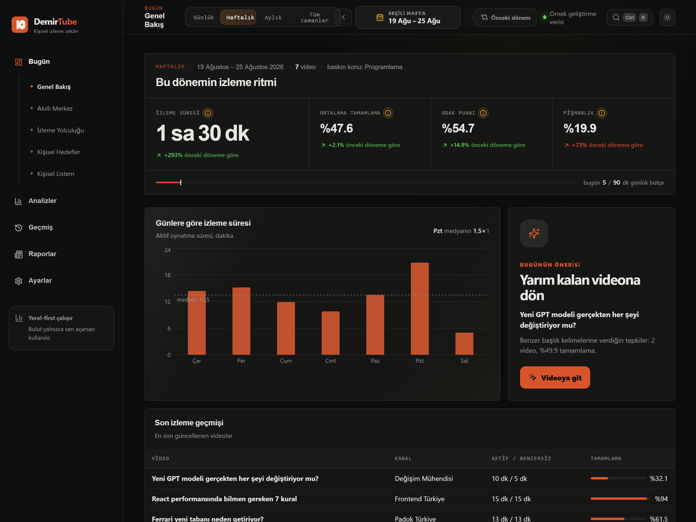
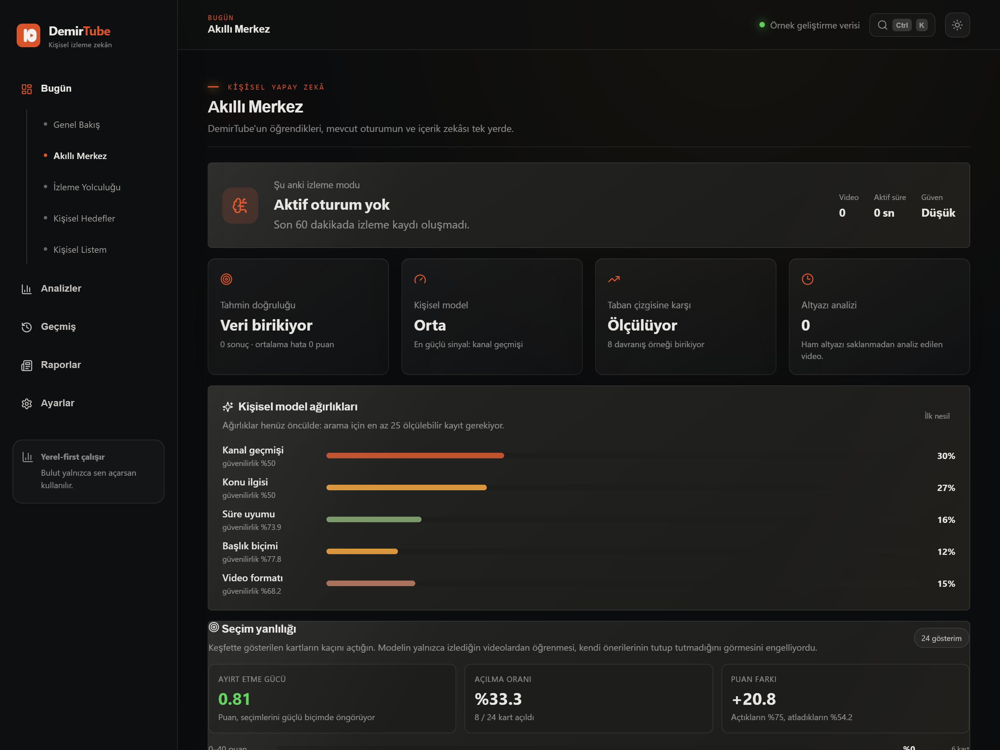

# DemirTube AI

[](https://github.com/berkdemir18/DemirTube/actions/workflows/ci.yml)

DemirTube, YouTube izleme davranışını yalnızca cihazında kaydeden ve zamanla hangi konu, kanal, başlık ve video sürelerini gerçekten sevdiğini açıklanabilir kurallarla analiz eden bir Chrome eklentisidir.

Sürüm 0.11.0; kendi tahmin hatasını ölçüp ağırlıklarını geçmişten öğrenen kişisel modeli, önerilerin tutup tutmadığını gösteren seçim yanlılığı ölçümünü, yerel akıllı yardımcıyı, isteğe bağlı Groq derin analizini ve keşfet kartlarındaki ön analiz rozetlerini birlikte sunar. DemirTube YouTube sayfasında görünen video metadata'sını analiz eder; oynatma davranışını yalnızca geçerli watch ve Shorts sayfalarında kaydeder. Kullanıcı Groq'u açıkça bağlarsa yalnızca video metadata'sı ve altyazıdan çıkarılmış kısa sinyaller ikinci bir yapay zekâ değerlendirmesine gider; ham altyazı ve izleme geçmişi gönderilmez. Yerel analiz, kişisel kalibrasyon ve isteğe bağlı bulut yedeği (Firebase veya Supabase) birbirinden bağımsız çalışır.



> Bu depodaki ekran görüntüleri `src/dashboard/seed-data.ts` içindeki örnek veriyle üretilir
> (`node scripts/capture-dashboard.mjs`); gerçek bir izleme geçmişi içermez.

## Neler çalışıyor?

- Tüm `youtube.com` rotalarında çalışan, yalnızca geçerli `/watch?v=…` veya `/shorts/{id}` sayfasında takip başlatan Manifest V3 içerik script'i
- Tam sayfa yenilenmeden gerçekleşen YouTube SPA video geçişlerini algılama
- YouTube'un video elementini değiştirmesi halinde otomatik yeniden bağlanma
- Yalnızca video oynarken, sekme görünürken veya video Picture-in-Picture/Opera Video Popout penceresindeyken ve oynatma hazırken aktif süre sayımı
- Duraklatma, ileri/geri sarma, sekme gizleme, en ileri/çıkış konumu ve doğal bitiş kaydı
- Toplam aktif, benzersiz izlenen ve tekrar izlenen süreleri ayrı hesaplama; oturumlar arası aralık birleştirme
- Benzersiz izleme tabanlı tamamlanma (aynı bölümün tekrar izlenmesi oranı şişirmez)
- İzlenen aralıkları saklama, ısı haritası ve 5 saniyede bir güvenli oturum kaydı
- Beş saniyelik kontrol noktaları, sekme gizlenince anlık kayıt ve sert kapanıştan sonra aktif oturum kurtarma
- Aktif video bitmeden erken çıkış veya pişmanlık olarak sınıflandırmama
- Yeni YouTube metadata düzenleri için kanal adı, kanal kimliği ve thumbnail fallback'leri
- Eksik kanal adları için YouTube JSON-LD/oEmbed yedeği ve eski “Bilinmeyen kanal” kayıtlarını dashboard açılışında onarma
- Aynı video için ayrı oturumlar ve birleştirilmiş video özeti
- Türkçe/İngilizce yerel konu sınıflandırması
- Açıklanabilir Pişmanlık, Sarılma, kanal uyumu ve video tercih puanları
- Güncel video kimliğiyle eşleşen YouTube oynatıcı verisi ve görünür canlı rozetlerinden canlı yayın tespiti; tamamlanma yerine aktif izleme süresi, geri dönüş ve etkileşim odaklı ayrı analiz
- Kullanıcı beğenisi, clickbait teyidi, kazara açılma, analiz dışı bırakma, erken çıkış nedeni, manuel konu ve içerik türü
- Genel Bakış, Konular, Kanallar, Video Süresi/İçerik Türü, Zaman Analizi, Başlık Analizi, İzleme Geçmişi, Haftalık Rapor ve Ayarlar ekranları
- Başlık kelimeleri ve iki/üç kelimelik cümlecikler; güven seviyesi ve özel kelime kuralları
- Başlık örüntüleri henüz tekrarlanmıyorsa boş ekran yerine açıkça işaretlenmiş tek-videoluk ön analiz
- Kullanıcı tanımlı özel konu kuralları
- Analiz ekranlarının tamamında ortak günlük, haftalık, aylık ve tüm zamanlar seçimi; dönemler arasında ileri/geri gezinme
- Tıklanabilir kanal profilleriyle gün gün kanal izleme grafiği, kanal kalite metrikleri ve dönemsel video listesi
- Aktif süre, benzersiz/tekrar izleme, oturum ritmi ve format performansını birleştiren ayrı İstatistikler ekranı
- Analiz ekranlarında seçili dönem ile önceki dönemi aktif süre, video, tamamlama ve Shorts payında yan yana karşılaştırma
- YouTube panelinde sayılıyor, duraklatıldı, sekme görünmüyor, yükleniyor ve konum değiştiriliyor durumlarını açıklayan canlı sayaç göstergesi
- Altyazı kategorileri ile gerçek izleme aralıklarını birleştiren bölüm ve dikkat haritası
- Video geçişlerini odak, araştırma, eğlence, kararsız gezinme ve Shorts döngüsü olarak gösteren İzleme Yolculuğu
- Öğrenme, Shorts payı, tamamlanan video ve gece izleme için cihazda saklanan düzenlenebilir haftalık hedefler
- Önceki haftaya göre belirgin izleme süresi, Shorts, tamamlama ve gece yoğunluğu değişimlerini gösteren anomali kartları
- Kanal detaylarında açıklanabilir “daha sık izle / seçici takip et / dikkatli seç” karar kartları
- İstatistik metriklerinden hesaplamaya dahil edilen yerel video ve oturum kanıtlarına geçiş
- Genel Bakış'ta aktif süre, tamamlanma, tamamlanan video ve ortalama Sarılma dahil altı dönemsel istatistik kartı
- Geçmişte arama, konu/kanal/tarih filtreleri, dört sıralama biçimi ve tek kayıt silme
- Takibi durdurma, tüm verileri silme, checksum’lı export v2, v1 uyumlu içe aktarma ve birleştir/değiştir önizlemesi
- Yerel veri sağlığı denetimi; açık oturum kapatma, özet yeniden hesaplama ve yetim kayıt temizleme
- Belirsiz video kayıtlarını tek ekrandan düzelten Geri Bildirim Merkezi
- Normal videolardan ayrı Shorts süresi, tamamlama, sarılma, pişmanlık ve saat dağılımı
- Son videonun neden seçilmiş olabileceğini kanal, konu, süre, başlık ve içerik türü sinyalleriyle açıklama
- Video açılır açılmaz amacını, değer türünü, derinliğini, odak yükünü ve zamana duyarlılığını çıkaran yerel akıllı ön analiz
- Başlık, açıklama, hashtag ve bölüm yapısından açıklanabilir olumlu/nötr/risk sinyalleri
- Tahmin ile gerçek izleme davranışını karşılaştıran izleme sonrası sonuç değerlendirmesi
- Dashboard'da güçlü format, başlık riski ve öğrenme/eğlence dengesi için otonom örüntü kartları
- YouTube'un canlı oynatıcı verisi, sayfa kaynağı veya görünür transkriptinden ham metni saklamadan anahtar kavram, bilgi yoğunluğu, tekrar oranı ve cümle kopyalamayan kategori-temelli önemli anlar
- Başlık vaadi ile altyazıda gerçekten işlenen kavramları karşılaştıran içerik tutarlılığı
- Sonuçlardan kanal, konu, süre, başlık ve doğrulanmış video formatı ağırlıklarını yeniden hesaplayan kişisel adaptif model
- Ana sayfa, arama ve öneri kartlarında video açılmadan önce uyum/amaç/başlık riski rozetleri
- Araştırma, öğrenme, eğlence, kararsız gezinme ve Shorts döngüsünü ayıran oturum zekâsı
- Konu derinliği ve konu bağlantılarını gösteren bilgi–ilgi haritası
- “Beğendiğim ama tamamlamadığım videolar” gibi sorguları anlayan yerel doğal dil araması
- Yarım kalan, sardığın veya bilgi yoğun videolar için akıllı yeniden izleme önerileri
- Tahmin doğruluğu, ortalama hata, sistematik sapma, gelişim yönü ve kişisel model güveni
- Geçmiş tahmin hatalarından kendini düzelten kalibrasyon ve kendi belirsizliğini bildiren tamamlanma tahmini ("%62 ± 14")
- Modeli geçmiş üzerinde kronolojik sınayan geriye dönük ölçüm; her video yalnızca kendisinden önceki kayıtlarla tahmin edilir
- Sinyal ağırlıklarını sabit bir tablodan okumak yerine geçmişte arayarak bulan öğrenme; ağırlıklar geçmişin ilk %70'inde öğrenilip dokunulmamış son %30'da ölçülür
- "Hep kişisel ortalamayı söyle" diyen taban modelle açık kıyas; model tabanı yenemiyorsa gizlenmez, arayüzde söylenir ve tahmin tabana yaklaştırılır
- Keşfette gösterilip açılmayan kartları da kaydeden seçim yanlılığı ölçümü: puanın hangi videoyu açtığını ne kadar öngördüğü (AUC), puan bantlarına göre açılma oranı ve "yüksek puan verilip açılmayan" kör noktalar
- Türkçe ek ve ünsüz yumuşamasını çözen konu tanıma ("güvenliği", "programlamayı", "maçın"), aksansız yazım toleransı ("besiktas", "yapay zeka")
- Elle düzeltilen konulardan kelime öğrenme ve tutarlı kanalların konusunu devralan kanal hafızası
- Tanıdık olmayan kanal ve konuya küçük, sınırlı keşif payı; model yalnızca geçmişe benzeyeni öne çıkarıp filtre balonu kurmaz
- Yerel standart, yerel gelişmiş ve isteğe bağlı Groq derin analiz modları
- Groq GPT-OSS 120B/20B ile Türkçe özet, önemli noktalar, başlık vaadi, değer, risk ve izleme önerisi
- Aynı video girdisi değişmedikçe yeniden API harcamayan güvenli analiz önbelleği
- Groq kota/ağ hatasında paneli bozmadan yerel gelişmiş analize otomatik geri dönüş
- 13 haftalık tıklanabilir İzleme Takvimi
- İki konu, kanal veya içerik türünü yan yana karşılaştırma
- Shorts, pişmanlık, bilinçli seçim ve konu değişimini önceki haftayla karşılaştıran gelişmiş rapor
- Analizlerde örnek sayısına bağlı düşük/orta/yüksek veri güvenilirliği
- Kullanıcı izniyle çalışan yerel JSON yedek hatırlatması
- İlk kurulum gizlilik ve veri olgunluğu tanıtımı
- Popup'ta dashboard açmadan okunan günlük nabız: bugünkü aktif süre, bütçe durumu, son yedi günün çubukları, izleme serisi ve günün öne çıkan konusu
- Dashboard'da Ctrl/Cmd+K komut paleti: sayfa, kanal, konu, analiz dönemi, hızlı işlem ve geçmişteki videoyu tek arama kutusundan açma
- Pişmanlık puanını izleme süresiyle çarpan Zaman Maliyeti ekranı: dönemin kaç saatinin pişman olunan içeriğe gittiği, en pahalı kanal ve konular
- Kanal profili ve konu odağı için paylaşılabilir adres (`#/channels?...&channel=…`), tarayıcı geri tuşuyla listeye dönüş
- Günlük bütçe aşılınca YouTube'da bir kez çıkan sakin uyarı şeridi ve tek tıkla "Shorts'u bugünlük gizle"
- Bir ekran hata verse bile ayakta kalan dashboard kabuğu
- Koyu/açık tema ve responsive dashboard
- YouTube sayfasında müdahalesiz, Shadow DOM ile izole edilmiş analiz paneli
- Aynı video içindeki metadata/altyazı güncellemelerinde sökülmeden yerinde yenilenen ve kapalıyken ağır analiz sorgusu çalıştırmayan akıcı YouTube yan paneli
- İlk 1–2 videoda sahte kesinlik yerine veri olgunluğu, saniye hassasiyeti ve gerçek oturum ayrıntıları
- İsteğe bağlı bulut yedeği: Firebase (Auth + Realtime Database) veya Supabase (RLS korumalı tablo), cihazlar arası birleştirme ve otomatik eşitleme
- Yerel veritabanı dışarıdan sıfırlandığında dashboard'da uyaran ve yedeğe yönlendiren veri kaybı dedektörü
- Analitik geliştirmesi için örnek seed verisi

## Kurulum ve üretim buildi

Gerekenler: Node.js 20+ ve npm.

```powershell
npm install
npm test
npm run build
```

Build çıktısı `dist/` klasörüne yazılır.

### Chrome'a unpacked olarak yükleme

1. Chrome'da `chrome://extensions` adresini aç.
2. Sağ üstten **Geliştirici modu** seçeneğini aç.
3. **Paketlenmemiş öğe yükle** düğmesine bas.
4. Bu projenin `dist` klasörünü seç.
5. Bir YouTube video sayfası aç. Sağ sütunda DemirTube paneli görünür.
6. Eklenti simgesinden **Dashboard'u aç** ile analiz ekranına git.

Kaynak kod değişince `npm run build` çalıştırıp uzantılar sayfasındaki yenile düğmesine bas.
Yenilemeden önce açık olan YouTube sekmeleri eski içerik script'ini taşır; eklentiyi yeniledikten sonra bu sekmeleri de bir kez yenile.
Chrome'un **Hatalar** ekranı geçmiş kayıtları kendiliğinden kaldırmaz. Yeni sürümü yükledikten sonra **Tümünü temizle** deyip YouTube sekmelerini yenileyerek yalnızca yeni hataları kontrol et.

## Mimari

```text
YouTube içerik script'i
  ├─ SPA ve video elementi gözlemi
  ├─ aktif süre / segment / olay takibi
  └─ chrome.runtime mesajları
             │
             ▼
Manifest V3 service worker
  ├─ tipli mesaj API'si
  ├─ analitik ve tercih skoru
  └─ repository katmanı
       ├─ IndexedDB: videos, sessions, feedback, customTopics,
       │             keywordRules, diagnostics, weeklyReports, impressions
       └─ chrome.storage.local: settings, bulut oturumu, senkron durumu,
                                 kişisel liste ve liste arşivi

İsteğe bağlı bulut (Firebase veya Supabase)
  ├─ Firebase Realtime Database: backups/<uid>, kural tabanlı hesap izolasyonu
  └─ Supabase: kullanıcıya özel RLS korumalı JSONB yedeği

İsteğe bağlı Groq
  └─ metadata + altyazıdan türetilmiş sinyallerle derin video analizi

Dashboard / Popup
  └─ aynı mesaj API'si ve yerel veri
```

İçerik script'i IndexedDB'ye doğrudan erişmez. Böylece veriler YouTube web kökeninde değil, uzantının kendi kökeninde saklanır. UI bileşenleri de IndexedDB ayrıntılarını bilmez; işlemler repository ve service worker katmanlarından geçer. Tarayıcı veya sekme kapanması IndexedDB kayıtlarını silmez. En fazla beş saniyelik aktif oynatma aralığı riskini azaltmak için periyodik kontrol noktaları ve sekme gizlenme kaydı kullanılır.

Vite, dashboard ve popup HTML girişlerini üretir. `scripts/build-extension.mjs`, service worker'ı bağımsız bir ES modülü ve içerik script'ini Chrome'un doğrudan çalıştırabileceği tek IIFE dosyası olarak paketler.

## Veri modeli ve puanlar

`VideoRecord`, bir videonun oturumlar arası birleşik özetidir. `WatchSession`, her gerçek açılış için ayrı tutulur. `PlaybackSegment[]` gerçekten izlenen zaman aralıklarını içerir. `totalActiveWatchSeconds` bütün aktif oynatma süresidir; `uniqueWatchedSeconds` örtüşmeleri tek sayar; `rewatchSeconds` ikisinin farkıdır.

Dashboard dönem seçildiğinde kart ve grafik toplamlarını `WatchSession` kayıtlarından yeniden kurar. Günlük görünüm seçili günü, haftalık görünüm seçili haftayı, aylık görünüm ise seçili takvim ayını kapsar. Böylece tüm zamanlar toplamı kısa dönem kartlarını şişirmez.

Pişmanlık puanı 0–100 arasında; ilk iki dakikada çıkış, düşük benzersiz tamamlama, hemen başka videoya geçiş, tekrar açmama, video süresi, başlık ifadeleri ve açık kullanıcı geri bildirimini birlikte değerlendirir. On saniyeden kısa veya kazara olarak işaretlenen açılışlara puan verilmez. Her puan etkenlerini ve güven seviyesini saklar.

Sarılma puanı 0–100 arasında; benzersiz tamamlama, tekrar izleme, geri sarma, yeniden açma, doğal bitiş ve açık beğeni/beğenmeme sinyallerini kullanır. Canlı yayınlarda klasik tamamlanma uygulanmaz; izleme süresi ve etkileşim sinyalleri korunur.

Kanal uyumu, üç videodan önce gösterilmez. Daha sonra:

```text
ortalama tamamlama × 0.35
+ tekrar izleme oranı × 0.20
+ normalize video başına izleme süresi × 0.15
+ erken kapatmama oranı × 0.15
+ ortalama sarılma × 0.15
− ortalama pişmanlık × 0.20
```

Sonuç Bayesyen yumuşatmadan geçer: az videolu bir kanal evrensel bir öncüle değil, kullanıcının kendi geçmiş ortalamasına çekilir.

Video tercih tahmini; kanal, konu, süre kovası, başlık kelimeleri ve doğrulanmış video formatını kullanır. Adaptif kişisel model (`adaptive-v5`) bu beş sinyalin ağırlığını sabit bir tablodan okumaz: geçmişi kronolojik yürütüp ortalama mutlak hatayı en aza indiren ağırlık vektörünü koordinat inişiyle arar. Ağırlıklar geçmişin ilk %70'inde öğrenilir, hata dokunulmamış son %30'da ölçülür ve "hep kişisel ortalamayı söyle" diyen taban modelle kıyaslanır; model tabanı yenemiyorsa bu saklanmaz, arayüzde söylenir ve tahmin tabana doğru harmanlanır.



Tamamlanma tahmininde kanıtlar bağımsız sayılmaz. Kanal, konu, format ve süre büyük ölçüde aynı videolardan geldiği için her katman bir alttakinin tahminini öncül alır: kişisel taban → süre/format → konu → kanal. Kalibrasyon iki parametrelidir; sabit sapmanın yanında tahmin seviyesine bağlı eğim de ölçülür ve kanıt 90 günlük ölçekle sönümlenir. Yerel video zekâsı ayrıca açıklama, hashtag, içerik amacı, bölüm yapısı, odak yükü, zamana duyarlılık ve erişilebilir altyazıyı yorumlar. En az iki kişisel sinyal yoksa uygunluk puanı üretmez; fakat video yapısının ön analizini düşük güven etiketiyle sunar.

Altyazı zekâsı yalnızca YouTube'un erişilebilir kıldığı altyazıyı kullanır ve altyazı ayarı açıkken seçili yerel/Groq analiz modundan bağımsız çalışır. `document_start` aşamasında çalışan küçük MAIN-world köprüsü, güncel SPA oynatıcısındaki altyazı izlerini izole içerik script'ine güvenli ve sınırlı mesajlarla aktarır. Köprü sonuç vermezse görünür transkript, sayfa script'i ve aynı kökenden video sayfası sırasıyla yedek olarak denenir. İzler geç yayınlanırsa DemirTube gecikmeli olarak yeniden dener; Türkçe ve insan üretimi altyazıyı önceleyip boş sonuçta diğer track'lere geçer. Timedtext içeriği, sayfa CORS kısıtlarından etkilenmemesi için yalnızca doğrulanmış `youtube.com/api/timedtext` adreslerine izin veren service worker üzerinden okunur; yanıt boyutu 4 MB ile sınırlıdır. JSON3 ve XML zamanlı metin yanıtları desteklenir. Ham altyazı kalıcı depoya veya buluta yazılmaz; yalnızca kelime sayısı, anahtar kavramlar, yoğunluk, tekrar, vaat kapsamı ve önemli zaman damgaları saklanır. Altyazı yoksa analiz diğer metadata ve davranış sinyalleriyle devam eder.

Video formatı sınıflandırması; ders, kurs bölümü, canlı kodlama, ekran demosu, vaka analizi, derin analiz, liste, soru-cevap, tartışma, panel, video deneme, hikâye, kutu açılımı, ilk bakış, walkthrough, derleme, kamera arkası, webinar, ASMR/ortam ve canlı performans gibi ayrıntılı biçimleri de ayırır. Kullanıcı tahmini panelden düzelttiğinde doğrulanan format sonraki kişisel tahminlere katılır.

Tercih puanı, kullanıcının genel tamamlama tabanına göre kalibre edilir. Az örnekli sinyaller nötre yakın tutulurken tekrar eden güçlü ve zayıf eşleşmeler daha geniş puan aralığına yayılır; seçili izleme amacı kişisel dağılımı ezmeden sınırlı bir düzeltme uygular.

## Gizlilik

- Zorunlu izinler `storage`, `alarms` ve `https://www.youtube.com/*` ile sınırlıdır.
- `https://*.supabase.co/*` izni opsiyoneldir; yalnızca kullanıcı **Projeyi bağla** dediğinde Chrome tarafından sorulur.
- `https://api.groq.com/*` izni opsiyoneldir; yalnızca kullanıcı **Groq'u bağla** dediğinde Chrome tarafından sorulur.
- `downloads` izni opsiyoneldir; yalnızca kullanıcı otomatik JSON yedeğini açtığında istenir.
- `https://ntfy.sh/*` izni opsiyoneldir; yalnızca kullanıcı telefon bildirimi için bir ntfy konusu kaydettiğinde istenir.
- Geçmiş, çerez, mikrofon, kamera veya genel site erişimi istenmez.
- Telemetri, analytics SDK'sı veya uzak JavaScript yoktur.
- Video ve oturumlar IndexedDB'de, ayarlar `chrome.storage.local` içinde kalır.
- Keşfette puanlanıp gösterilen kartların kaydı (`impressions`) yalnızca cihazda tutulur, en fazla 120 gün ve 4.000 kayıt saklanır, günde bir budanır ve JSON dışa aktarmaya dâhil edilmez. Bu kayıt olmadan "model iyi öneri yapıyor mu" sorusu ölçülemez, çünkü elde yalnızca zaten açılmış videolar kalır.
- Bulut kapalıyken hiçbir izleme verisi sunucuya gönderilmez.
- Groq'a video açılışında otomatik istek gönderilmez. Yalnızca kullanıcı video panelindeki **Groq ile derin analiz** düğmesine bastığında başlık, kanal, açıklama, konu, süre, içerik türü ve altyazıdan türetilmiş kısa analiz gönderilir.
- Groq API anahtarı yalnızca `chrome.storage.local` içinde tutulur; JSON dışa aktarmaya veya bulut yedeğine (Firebase/Supabase) eklenmez.
- Ham altyazı, oturum geçmişi, davranış puanları ve kullanıcı geri bildirimi Groq'a gönderilmez.
- Bulut açıldığında yalnızca kullanıcının seçtiği Firebase veya Supabase projesine HTTPS üzerinden yedek gönderilir.
- Bulut hesabının şifresi saklanmaz. Oturum ve yenileme tokenları yalnızca eklentinin yerel depolamasında tutulur.
- RLS politikaları her hesabın yalnızca kendi `user_id` satırını okumasını ve değiştirmesini sağlar.
- JSON dışa aktarma aktif kişisel listeyi ve liste arşivini de içerir. Otomatik yedek, kullanıcı açarsa aynı veriyi İndirilenler/DemirTube klasörüne kaydeder.
- ntfy telefon bildirimi açıldığında haftalık özet (dakika, video sayısı, tamamlama oranı) seçilen ntfy konusuna gönderilir. Konu adı erişim anahtarı gibidir; uzun ve tahmin edilmez bir ad kullan.
- Takip tek düğmeyle durdurulabilir; ayar değişikliği açık YouTube sekmelerine anında uygulanır.
- Tüm veri veya tek bir video kaydı kullanıcı tarafından silinebilir.

### İzin açıklaması

| İzin | Neden gerekli? |
| --- | --- |
| `storage` | Tema, takip tercihi, isteğe bağlı bulut yapılandırması ve son senkronizasyon durumunu eklentinin yerel alanında saklar. |
| `alarms` | Sert kapanıştan sonra devam eden bulut eşitleme planı ve haftalık rapor zamanlaması için kullanılır. |
| `https://www.youtube.com/*` | İçerik script’inin YouTube SPA rotaları arasında yüklü kalmasını sağlar. İzleme yalnızca geçerli `/watch?v=…` veya `/shorts/{id}` rotasında başlar. |
| `notifications` (isteğe bağlı) | Yalnızca kullanıcı haftalık bildirimi açarsa istenir ve rapor hazır bilgisini gösterir. |
| `downloads` (isteğe bağlı) | Yalnızca kullanıcı otomatik JSON yedeğini açarsa, yedeği İndirilenler/DemirTube klasörüne kaydetmek için istenir. |
| `https://*.supabase.co/*` (isteğe bağlı) | Yalnızca kullanıcı kendi Supabase projesini bağlarsa o projeye HTTPS yedeği için istenir. |
| `https://identitytoolkit.googleapis.com/*`, `https://securetoken.googleapis.com/*` (isteğe bağlı) | Yalnızca kullanıcı Firebase'i bağlarsa hesap açma, giriş ve oturum tazeleme için istenir. |
| `https://*.firebasedatabase.app/*`, `https://*.firebaseio.com/*` (isteğe bağlı) | Yalnızca kullanıcı Firebase'i bağlarsa yedek düğümünü okumak/yazmak için istenir. |
| `https://api.groq.com/*` (isteğe bağlı) | Yalnızca kullanıcı Groq derin analizini bağlarsa model ve sohbet tamamlama istekleri için istenir. |
| `https://ntfy.sh/*` (isteğe bağlı) | Yalnızca kullanıcı telefon bildirimi için bir ntfy konusu kaydederse haftalık özet push'u göndermek için istenir. |

## Groq derin analizini açma

Groq tamamen isteğe bağlıdır; anahtarsız kullanımda DemirTube yerel gelişmiş modda çalışır.

1. [Groq API Keys](https://console.groq.com/keys) sayfasında ücretsiz bir anahtar oluştur.
2. DemirTube **Ayarlar → Groq ücretsiz AI** bölümünü aç.
3. Anahtarı gir, GPT-OSS 120B veya daha hızlı 20B modelini seç.
4. Chrome'un yalnızca `api.groq.com` için istediği bağlantı iznini onayla.
5. Bir video açıp DemirTube panelinin **AI** sekmesindeki **Groq ile derin analiz** düğmesine bas.

Ücretsiz planın hız ve günlük kullanım sınırları Groq tarafından belirlenir. Sınır dolarsa kayıt ve yerel analiz kesilmez; yalnızca Groq kartı yeni yanıt gelene kadar yerel sonuçlarla devam eder.

## Bulut yedeklemeyi açma

Bulut özelliği isteğe bağlıdır. Yerel kayıt için bu adımlar gerekmez.

Sağlayıcı olarak **Firebase** veya **Supabase** seçilebilir; ikisi de aynı yedeği tutar, aynı birleştirme mantığıyla çalışır ve **Ayarlar → Bulut yedekleme** kartındaki seçiciden belirlenir.

### Firebase

1. [Firebase Console](https://console.firebase.google.com) üzerinden ücretsiz bir proje oluştur.
2. **Authentication → Sign-in method** ekranında *E-posta/Şifre* yöntemini aç.
3. **Build → Realtime Database → Create Database**; konum olarak `europe-west1`, başlangıç kuralı olarak *locked mode* seç.
4. **Rules** sekmesine [`firebase/database.rules.json`](firebase/database.rules.json) içeriğini yapıştırıp yayınla.
5. **Proje ayarları → Genel → Web uygulaması** bölümünden `apiKey`, Realtime Database ekranından da veritabanı adresini al.
6. DemirTube **Ayarlar → Bulut yedekleme → Firebase** alanlarına bu iki değeri gir ve alan adı izinlerini onayla.
7. E-posta ve şifreyle hesap oluştur veya giriş yap.

Yedek, `backups/<uid>` düğümünde tek bir JSON metni olarak tutulur; yanındaki `meta` düğümü yalnızca özet, tarih ve kayıt sayısını taşır.

Sağlayıcı seçimlerinin gerekçesi:

- **Cloud Storage değil**, çünkü Firebase, Ekim 2024'ten sonra açılan projelerde Storage için ücretli Blaze planı istiyor; Realtime Database ücretsiz Spark planında kalmaya devam ediyor (1 GB saklama, aylık 10 GB indirme).
- **Firestore değil**, çünkü bir Firestore belgesi en fazla 1 MiB tutar ve tek kullanıcının izleme geçmişi bunu birkaç ayda aşar.
- Yedek **ağaç olarak değil tek metin olarak** yazılır: Realtime Database boş dizileri ve null alanları saklamaz, dizileri nesneye çevirir; ağaç olarak yazılsa geri okunan yedek yerelden farklı biçimde dönerdi.

Senkron her 15 dakikada bir çalıştığı için önce yalnızca `meta` okunur; uzaktaki sürüm bu cihazın en son yazdığı sürümse gövde hiç indirilmez, yerel içerik değişmediyse de hiç yüklenmez. Firebase web `apiKey`'i gizli bir anahtar değildir; yedeği koruyan şey `database.rules.json` içindeki hesap eşleşmesidir.

### Supabase

1. [Supabase Dashboard](https://supabase.com/dashboard) üzerinden ücretsiz bir proje oluştur.
2. SQL Editor'ı aç ve [`supabase/schema.sql`](supabase/schema.sql) dosyasının tamamını çalıştır.
3. Supabase **Project Settings → API** ekranından Project URL ve anon/publishable key'i al.
4. DemirTube **Ayarlar → Bulut yedekleme → Supabase** alanlarına bu iki değeri gir.
5. `*.supabase.co` bağlantı iznini onayla.
6. E-posta ve şifreyle hesap oluştur veya giriş yap.

İlk girişte yerel ve uzaktaki video/oturumlar kimliklerine göre birleştirilir. Sonrasında kayıt durduktan yaklaşık 30 saniye sonra ve 15 dakikalık periyotlarla otomatik eşitleme planlanır. Tarayıcı eşitlemeden önce kapanırsa görev sonraki Chrome açılışında devam eder.

## Geliştirme

```powershell
npm run typecheck
npm test
npm run build
```

Eklenti bağlamı olmadan `npm run dev` ile açılan dashboard, yalnızca arayüz geliştirmesi için `src/dashboard/seed-data.ts` içindeki örnekleri gösterir. Production uzantısında dashboard gerçek yerel veriyi service worker'dan alır.

## Test ve sürüm doğrulama

```powershell
npm run typecheck
npm test
npm run build
npm run test:browser
```

Her `main` push'unda ve pull request'te GitHub Actions aynı üçlüyü (`typecheck`, `test`, `build`) çalıştırır, ayrı bir işte üretim paketini xvfb altında Playwright ile açar ve yüklenebilir `dist` paketini artifact olarak bırakır: [`.github/workflows/ci.yml`](.github/workflows/ci.yml).

`test:browser`, üretim `dist` paketini Playwright Chromium’a MV3 uzantısı olarak yükler, dashboard açılışını ve müdahale edilmiş bir YouTube watch sayfasında içerik panelinin montajını doğrular. Yerel makinede Playwright'ın görünür Chromium penceresi açmasına izin verilmelidir.

## Bilinen sınırlar

YouTube DOM seçicileri platform güncellemelerinde değişebilir; metadata okuyucusu birden fazla güvenli seçici ve fallback kullanır. Başlık/kanal metadata’sı bulunamadığında kayıt korunur ve sonraki dashboard açılışında oEmbed onarımı denenir.

İçerik türü tespiti güvenli sezgiseldir ve kullanıcı tarafından düzeltilebilir. Haftalık bildirim açılırsa Chrome yalnızca o anda isteğe bağlı `notifications` iznini sorar; izin verilmezse rapor dashboard’dan elle üretilebilir. Bu sürüm hiçbir tahmini yapay zekâ kesinliği gibi sunmaz.
